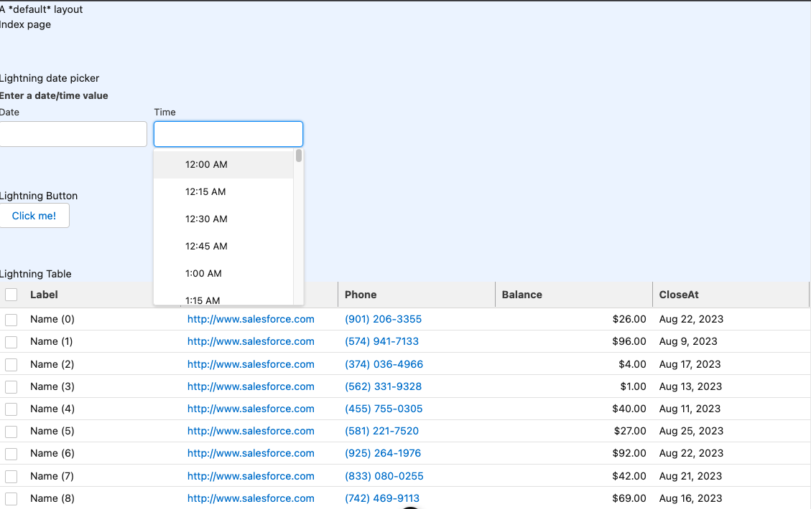

# Nuxt 3 Minimal Starter with Salesforce Lightning Web Components



## Setup

Make sure to install the dependencies:

```bash
yarn install
```

Compile the Lightning Web Component Configuration
```bash
yarn build-lwc
```

## Configure LWC

To add LWC from the lightning base components, you can import them in src/index.js, for example to include the lightning-button, add:
```
import Button from 'lightning/button';

customElements.define('lightning-button', Button.CustomElementConstructor);
```
- After adding the component compile the LWC configuration again:
```bash
yarn build-lwc
```

## Development Server

Start the development server on `http://localhost:3000`:

```bash
yarn dev
```

## Production

Build the application for production:

```bash
yarn build
```

Locally preview production build:

```bash
yarn preview
```


####    LWC in Vue

- How to setup base components:
[Title](https://salesforce.stackexchange.com/questions/323613/lightning-open-source-use-of-base-components)

[Title](https://salesforce.stackexchange.com/questions/340594/lwc-build-files-explaination)

- Disable SSR due to bug:  [Title](https://github.com/lit/lit/discussions/2259)